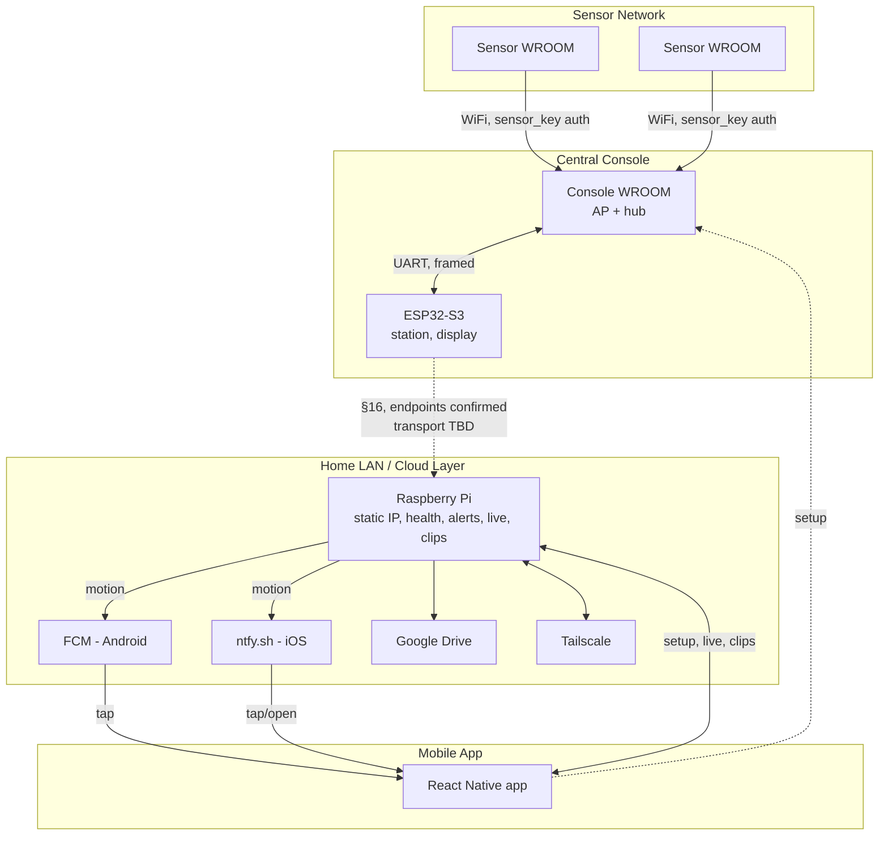
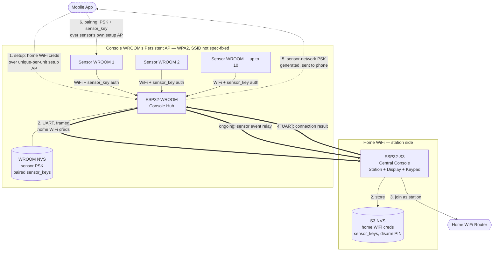
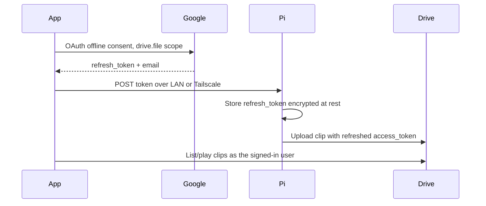

# Home Security System — Full Architecture

Status: design draft — SoftAP shipping; Pi hub (`pi_hub`) barebones in repo; live/clips/Drive stubs pending full impl
Scope: end-to-end system — ESP32 hardware, provisioning, sensor pairing, security model, protocol specs, Pi/app/cloud product layer (alerts, live, clips), and known open items.
Merges: original ESP32 hardware architecture + `Local-First Architecture Storyboard` (mobile/, Pi, Tailscale, FCM/ntfy, Drive).
Pi software: Python SoftAP gate + one `pi_hub` process (not the retired Node `rasberry_pi_app` / cloud stack) — see **D20** and §13.

---
## Branch Naming Convention
Three types of tasks:
1. Rasberry Pi pie
2. ESP esp
3. Mobile app mob
Name of person working: firstname
Bitesized task: task

So the branch name will be: type-firstname-task


## Quick nav

| Section | Contents |
|---|---|
| [1](#1-system-overview) | System overview & diagram |
| [2](#2-hardware--component-roles) | Every component's role |
| [2.1](#21-esp32-architecture-diagram) | ESP32 hardware diagram — networks, UART, credential flow |
| [3](#3-decision-log) | Locked product choices |
| [4](#4-console-provisioning-flow) | Phone → console WROOM → S3 → home WiFi |
| [5](#5-sensor-pairing-flow) | Phone → sensor → console WROOM |
| [6](#6-default-ap-credentials-setup-time) | Anti-eavesdropping setup credentials |
| [7](#7-credential--key-model) | The three secrets, who holds what |
| [8](#8-failure-handling-provisioning) | WiFi connect failure/retry |
| [9](#9-uart-protocol-wroom--s3) | Frame format, command set |
| [10](#10-setup-ap-encryption) | WPA2 requirement on all setup APs |
| [11](#11-psk-recovery--backup) | Pi as PSK backup, tied to §16 |
| [12](#12-reboot--reconnect-behavior) | Console/S3/sensor reboot handling |
| [13](#13-pi-setup--product-hub) | SoftAP gate → `pi_hub` (live/clips); how it works & deploy |
| [14](#14-intruder-alerts-android-fcm--ios-ntfysh) | FCM (Android), ntfy.sh (iOS) |
| [15](#15-on-demand-livestream-tailscale) | Live only while app is open |
| [16](#16-pi--s3-link-confirmed-endpoints-transport-tbd) | Confirmed Pi↔S3 endpoints; transport still TBD |
| [17](#17-clips-pi-cache--google-drive) | Clip capture, cache, upload, playback |
| [18](#18-google-token-handoff) | OAuth refresh token to Pi |
| [19](#19-motion-event-pipeline-partially-resolved) | Camera confirmed Pi-only; alert-pipeline scope still open |
| [20](#20-arm--disarm-state-machine) | State ownership, authorization, entry/exit, sensor behavior |
| [21](#21-out-of-scope) | Explicit non-goals |
| [22](#22-open-items) | Full consolidated list |
| [23](#23-physical--manufacturing-notes) | Enclosure & label handling |

---

## 1. System Overview

Three physical subsystems, tied together by two links that are fully specified and one that is not yet:



**Fully specified today:** sensor ↔ console WROOM (WiFi + `sensor_key`), console WROOM ↔ S3 (UART, framed), phone ↔ Pi (SoftAP setup, health check, Tailscale, OAuth handoff, FCM/ntfy targets, Drive playback).

**Confirmed but not yet fully specified:** S3 ↔ Pi. The endpoints are settled — this is a direct Pi↔S3 link, not routed through the WROOM (§16, §20) — but the transport mechanism (static IP / mDNS / hybrid), framing, and auth are still open. Everything downstream of it (motion-triggered alerts reaching the Pi, PSK backup reaching the Pi, the PIN-set flow) depends on this transport being finalized.

---

## 2. Hardware & Component Roles

| Component | Role | WiFi / Network Mode | Responsibilities |
|---|---|---|---|
| ESP32-S3 | Central console | Station (home WiFi) | Display, keypad (PIN entry for disarm — see §20), stores home WiFi creds, stores sensor keys, **stores the disarm PIN in NVS**, relays credentials/status to console WROOM over UART. Motion/event relay toward Pi confirmed required — see §16, §20. |
| ESP32-WROOM (console-side) | Sensor hub / pairing surface | Access Point (persistent, currently `"espwifi"` — SSID string is not a hard spec requirement, any static value works) | Hosts sensor network, relays sensor data to S3 via UART, validates sensor auth (`sensor_key`), generates pairing credentials and the sensor-network PSK |
| ESP32-WROOM (sensor units) | Sensors | Station → connects to console WROOM's AP | Motion/door/etc. detection, sends events authenticated with `sensor_key`. Currently the system's only motion-alert trigger — see §19. |
| Raspberry Pi | Setup relay, PSK backup, product hub | AP (setup only) → Station (post-setup, static IP `192.168.0.236`) | **Initializes first, before console provisioning — see §4, §13.** SoftAP (`pi-setup-*`) then one Python **`pi_hub`** on `:4000` (live HLS, clips, Drive — D20). Owns the camera (monitoring/live only for now — §19); FCM/ntfy alerts; Tailscale live; Drive clip upload; PSK backup pending §16 |
| Mobile App (React Native, `mobile/`) | Orchestrator / client | N/A | Walks the user through both the Pi setup flow and the console/sensor provisioning flow, holds home WiFi creds in memory only during setup, stores the sensor-network PSK for future pairing, saves the Pi host, registers for push (FCM/ntfy), handles Google OAuth and hands the refresh token to the Pi, plays live (via Tailscale) and clips (via Drive) |

**Confirmed: no camera on any ESP32.** The camera is Pi-attached only, and is monitoring/live-view only for now — camera-based motion detection is a planned post-launch feature, not part of this design. See §19.

**Confirmed: the console has a physical keypad**, used for PIN entry on disarm (§20). **The PIN itself is stored in S3 NVS**, not on the Pi — this creates a flagged tension with the Pi-as-state-authority decision, see §20. **No local audio/siren hardware is planned for initial release** — the console is display + keypad only; Bluetooth speaker support (as a post-launch siren option) is roadmap, not v1.

**Key architectural point:** the console WROOM's AP is *not* home WiFi — it's a separate, persistent local network (currently named `"espwifi"`, but the name itself isn't a spec requirement — see §22 item 6 for the planned move to per-unit SSIDs) that only the S3 (via UART) and paired sensors ever touch. The S3 never joins this network over WiFi. Separately, the Pi runs on the actual home LAN with its own static IP, reachable by the phone directly and, once §16 is resolved, by the S3.

### 2.1 ESP32 Architecture Diagram



**Reading the diagram:**
- **Dashed arrows** — one-time setup/pairing traffic over a temporary WPA2 setup AP (§4, §5, §6).
- **Double solid arrows (`==`)** — the framed UART link between WROOM and S3 (§9), carrying both provisioning handoff and ongoing sensor-event relay.
- **Single solid arrows** — persistent WiFi connections: sensors to the console WROOM's AP (network-level PSK + application-level `sensor_key`, §7), and the S3 to the home router.
- **Two distinct WiFi networks, never bridged over the air:** home WiFi (S3 only) and the console WROOM's persistent AP network (WROOM + sensors — SSID currently `"espwifi"`, not a fixed spec value). The only link between them is the physical UART trace inside the enclosure (§23).

---

## 3. Decision Log

| ID | Decision | Choice | Notes |
|---|---|---|---|
| D1 | Mobile client | React Native Expo app in `mobile/` | Dev/prod build for push; not Expo Go |
| D2 | Android alerts | `expo-notifications` + FCM | Pi sends FCM on motion |
| D3 | iOS alerts | Public ntfy.sh | Secret topic; no Tailscale required for the buzz |
| D4 | Livestream path | Tailscale to Pi | On-demand, only while app is open |
| D5 | Alert transport | No persistent WebSocket | FCM / ntfy wake the user instead |
| D6 | Clip storage | Pi cache → Google Drive | App reads Drive; no Tailscale needed for clips |
| D7 | Drive auth | Phone Google OAuth → refresh token handed to Pi | Not password-based; `drive.file` scope only |
| D8 | Remote product tunnel | Tailscale (not ngrok/Cloudflare as product) | ngrok OK for ad-hoc dev only |
| D9 | Pi ↔ S3 discovery/transport | Endpoints confirmed (Pi ↔ S3 direct); mechanism **TBD** | mDNS or static IP — see §16 |
| D10 | Cloud S3 / cloud-backend clips | Retired as a product path | Local-first + Drive instead |
| D11 | Sensor-network auth | WiFi PSK (network-level) + `sensor_key` (application-level) | See §7 |
| D12 | Sensor AP fallback on disconnect | None — physical reset only | Prevents jamming-based sensor knockout, see §12 |
| D13 | Setup AP credentials | Unique per unit (batch-derived minimum, MAC-HMAC preferred) | Prevents shared-default eavesdropping, see §6 |
| D14 | Home WiFi credential storage | S3 NVS only | WROOM relays over UART but never persists home WiFi creds — see §7, §2.1 |
| D15 | Camera hardware | Pi-attached only, no ESP32 has a camera | See §2, §19 |
| D16 | UART frame format | `SYNC(2B) \| CMD(1B) \| LEN(2B) \| PAYLOAD \| CRC(1-2B)`, bidirectional | Locked before coding — see §9 |
| D17 | Sensor-network PSK lifecycle | Never regenerated on WROOM reboot — persists across reboots | Regenerating would force re-pairing every paired sensor, see §12 |
| D18 | UART link security | Plaintext, trusted via physical enclosure only | Accepted risk given enclosed PCB, not link-layer encrypted — see §9, §23 |
| D19 | "Encrypted SSID" terminology | Means a high-entropy random **PSK**, not literal SSID encryption | SSIDs broadcast in cleartext regardless — see §7 |
| D20 | Pi product software | **Python SoftAP + one `pi_hub` process** (Flask); do **not** revive Node `rasberry_pi_app` or cloud `:3001` as product | SoftAP is the boot gate; live + clips share one process so they don't fight over `/dev/video0`. Old Node pushed HLS/clips to cloud — local-first serves HLS from Pi and uploads clips to Drive. Code: `rasberry-pi-setup/`. See §13 |

---

## 4. Console Provisioning Flow

Goal: get the S3 onto home WiFi and generate the sensor-network PSK, using the phone as a one-time relay. **Confirmed: this runs after Pi initialization (§13) — Pi setup happens first in the unified onboarding flow.**

1. User enters home WiFi SSID + password once in the app. Held in memory only — never persisted to disk.
2. Phone connects to the console WROOM's setup AP (unique per-unit credentials, WPA2-secured — §6, §10).
3. Phone sends the home WiFi SSID/pass to the WROOM.
4. WROOM relays the credentials to the S3 over UART (framed — §9).
5. S3 attempts to join home WiFi as a station, bounded timeout (~9s), signaled on `IP_EVENT_STA_GOT_IP` (not `WIFI_EVENT_STA_CONNECTED` — association without a leased IP must not report success).
6. S3 reports the connection result (success or specific failure reason) back to WROOM over UART.
7. On success: WROOM generates a random, high-entropy sensor-network PSK (§7), if not already generated on first boot. SSID is a static, fixed string (`"espwifi"`) — not MAC-derived (see §22 item 6 for the planned move to per-unit SSIDs). Brings up its persistent AP under these credentials and sends the PSK back to the phone over the still-open setup link.
8. Phone stores the PSK for future sensor pairing. WROOM's setup AP closes / transitions to sensor-hub-only mode. **Currently commented out in firmware** for debugging — the setup AP is left running past this point so pairing traffic can be inspected/retried without a fresh flash cycle. Must be re-enabled before this leaves dev.
9. WROOM sends the PSK to the S3 over UART; the S3 pushes a copy to the Pi for backup (§16, Pi↔S3 link) — this step depends on §16's transport being finalized; it is not yet a working link.
10. On failure: see §8.

This is a one-time flow, not repeated per sensor.

---

## 5. Sensor Pairing Flow

Done once per sensor, any time after console provisioning, using the PSK the phone already has stored.

1. New sensor boots in AP mode, broadcasting its own unique per-unit setup AP (§6).
2. Phone connects to the sensor's setup AP.
3. Phone sends the console WROOM's sensor-network SSID + PSK to the sensor.
4. Sensor switches to station mode and connects to the console WROOM's persistent AP.
5. Sensor authenticates at the application layer using `sensor_key` (§7) — WiFi-level connection alone does not grant trust.
6. WROOM validates the `sensor_key`, marks the sensor as paired, stores the key in NVS, and begins relaying its events to the S3.

**Constraint — pairing requires the WROOM AP not be at capacity:** the same persistent AP serves both ongoing sensor traffic and new-sensor pairing. Confirmed system limit: sensor count will not exceed 10 (ESP32 SoftAP station cap). App should check station count before initiating pairing and prompt the user if the AP is at or near capacity (exact UX not yet finalized — §22).

---

## 6. Default AP Credentials (Setup-Time)

**Current state: hardcoded shared default.** All units currently ship with the same fixed setup AP credentials, baked into firmware — not per-unit, not batch-derived. This reopens the eavesdropping window the design intends to close: anyone who knows the shared default (e.g. from a leaked unit, teardown, or public firmware) could intercept home WiFi or PSK credentials on any other unit's setup AP during provisioning.

**Planned: unique-per-unit credentials**, not a shared default — this is the fix for the above. Target approach: batch-unique credentials at minimum (shipped per manufacturing batch), with an upgrade path to fully per-device derived credentials:

```
ap_password = HMAC(batch_secret, MAC_address) → encode → print on label/QR
```

No provisioning database required — each unit would derive its own password locally and deterministically at boot from its own MAC address and a batch secret baked into firmware at flash time. Not yet implemented — see §22.

Requirements regardless of tier (apply today, independent of hardcoded-vs-derived):

- Setup AP is WPA2-secured using the current password — never open (§10).
- Setup AP auto-closes after a timeout (2–5 minutes) if no provisioning occurs.
- Re-entering setup/pairing mode after timeout requires a physical button press, not an always-available AP.
- The printed label/QR (once per-unit derivation lands) must not be visible on the outside of retail packaging (§23). Not applicable yet under the current shared-default state — there's nothing unit-specific to print.

---

## 7. Credential & Key Model

Four distinct secrets exist on the ESP32 side. They must not be conflated:

| Secret | Generated by | Purpose | Stored where |
|---|---|---|---|
| Home WiFi SSID/pass | User (typed once) | Lets S3 join home WiFi | S3 NVS only — WROOM does not persist it, only relays via UART |
| Sensor-network PSK | Console WROOM (random, high-entropy, 32-char alphanumeric via `esp_random()`) | WPA2 password for the WROOM's persistent AP | Phone app (primary), Pi (backup — pending §16), WROOM NVS |
| `sensor_key` | Console WROOM, generated uniquely per sensor during pairing | Application-layer authentication of each sensor after WiFi connection | WROOM NVS (per paired sensor), sensor's own NVS |
| Disarm PIN | User, set via the mobile app | Authorizes disarm from the console keypad or the app — see §20 | **S3 NVS.** This is the odd one out: unlike the other three, it's not device-provisioning material, and its storage location creates a flagged tension with the Pi being the arm/disarm state authority — see §20. |

**Why `sensor_key` matters:** the sensor-network PSK is shared across all paired sensors — anyone who obtains it could join the WiFi network. `sensor_key` prevents an arbitrary WiFi-connected device from impersonating a sensor; the WROOM only accepts data from sensors presenting a valid, previously-issued key.

A parallel pattern exists on the product side: the Drive OAuth **refresh token** (§18) is a fifth secret, phone-mediated to the Pi the same way the PSK is phone-mediated to sensors — see §22 for the open question of unifying these into one "phone → device secret handoff" primitive.

Terminology note: nothing here is literal SSID encryption — SSIDs broadcast in cleartext regardless. What's unique/high-entropy is the **PSK** and the **`sensor_key`**, not the SSID (which can simply be MAC-derived and unique).

---

## 8. Failure Handling (Provisioning)

**Confirmed: binary outcome only.** The S3 reports `wifiConnection: true` or `wifiConnection: false` over UART — no reason code is surfaced to the WROOM, the phone, or the app. Wrong password, SSID not found, weak signal, and any other `WIFI_EVENT_STA_DISCONNECTED` cause all collapse to the same `false`. The app's only recourse on failure is to let the user retry.

`wifi_event_sta_disconnected_t->reason` is captured firmware-side (S3) at the point of disconnect but intentionally not forwarded over UART or wired into any command — available for future use if reason-level UX is ever built, but out of scope now.

Rules:

- Setup AP (WROOM or Pi) stays alive across a failed attempt — not torn down until success is confirmed.
- No retry cap on the S3's underlying `esp_wifi_connect()` reconnect loop — it retries indefinitely on disconnect. This is by design: a `false` result has already reached the phone, so the user can re-enter credentials and trigger a fresh attempt at any time; capping retries and requiring a physical button adds friction without a corresponding safety need here (contrast §12's sensor reconnect, where the no-fallback cap is a deliberate anti-jamming measure, not a UX one).

---

## 9. UART Protocol (WROOM ↔ S3)

Bidirectional framing required — both directions carry meaningful payloads.

```
[SYNC: 0xAA 0x55] [CMD: 1B] [LEN: 2B] [PAYLOAD: N bytes] [CRC: 1-2B]
```

Minimum command set to define before coding:

- `WROOM → S3`: home WiFi SSID/pass payload
- `S3 → WROOM`: connection result (success / specific failure reason)
- `WROOM → S3`: sensor event relay (post-pairing, ongoing telemetry)
- `S3 → WROOM`: commands (arm/disarm, etc.) to be relayed onward to sensors
- `S3 → WROOM`: status/heartbeat
- **`WROOM → S3`: motion/event notification tagged for Pi relay** — new command needed once §16's transport lands; distinct from routine telemetry if it needs different urgency/handling given the alert latency budget (§16)

**Flagged ambiguity:** the "commands relayed onward to sensors" line above implies each sensor is told the current arm state directly. But §20 states sensors "relay to the Pi only while armed," and the "sensor event relay" line above describes WROOM→S3 telemetry as unconditional/ongoing — these two aren't obviously the same design. Not yet decided: does arm/disarm state propagate all the way to each sensor (so a disarmed sensor stops transmitting entirely — relevant for battery life, §22 item 10), or do sensors always transmit and the WROOM/S3/Pi layer decides whether to act on it? Added to Open Items (§22).

The disarm PIN does **not** need a UART command — it's confirmed to travel `Pi → S3` directly (§16, §20) and never touches the WROOM.

Without framing, a byte-stream split across two reads on either side will silently corrupt credential or event payloads — this must be a checksummed, framed protocol.

Trust assumption: this UART link is internal to an enclosed PCB inside the house; physical access implies the system is already compromised, so plaintext credentials on this link are an accepted risk given the enclosure.

---

## 10. Setup AP Encryption

All temporary setup APs (Pi, console WROOM, sensor WROOMs) must run WPA2 using their unique per-unit password (§6) — never open. An open setup AP would let anyone in range passively sniff home WiFi credentials and the sensor-network PSK regardless of how unguessable the SSID is. Unique SSID ≠ encryption.

---

## 11. PSK Recovery / Backup

The phone app is not the sole holder of the sensor-network PSK. A backup copy should be pushed to the Raspberry Pi once both are on home WiFi.

**This depends on §16 (Pi↔S3 link), whose endpoints are now confirmed but transport/auth is still undesigned.** Do not build a one-off transport just for this — once §16's transport and auth are chosen, reuse them for the PSK backup push rather than inventing a second channel.

Open items:

- Push vs. pull, and behavior if the Pi is offline or unprovisioned when the PSK is generated — console/sensor setup should not block on Pi availability.
- Whether the Pi is required for day-to-day operation or purely a setup/recovery aid. Current intent: console and sensors keep operating autonomously if the Pi is off or removed — but §16 makes the *alerting* path (not sensor operation) look Pi-dependent. See §16.

---

## 12. Reboot / Reconnect Behavior

- **Console WROOM reboot:** AP credentials restored from NVS immediately on boot — same SSID/PSK, never regenerated (sensors already hold the old ones and would need re-pairing otherwise). Sensor data buffered by WROOM if the S3 link is briefly down, capped queue (e.g., 50 messages), dropping oldest on overflow.
- **S3 reboot:** WROOM's AP and sensor connections unaffected. WROOM buffers sensor events until UART with the S3 resumes.
- **Sensor loses connection to console:** sensor retries using the console's MAC address (not IP) with exponential backoff. **No automatic fallback to AP mode** — deliberate, to prevent a jamming attack from forcing sensors into a re-pairable, disconnected state (e.g., disabling motion detection). Re-entering pairing/setup mode requires a physical action (button hold).

---

## 13. Pi Setup & Product Hub

The Pi runs its own independent SoftAP-based setup flow (implemented under `rasberry-pi-setup/`), separate from the console's provisioning in §4. **Confirmed: this runs first in the unified onboarding flow** — the console's setup (§4) happens after Pi initialization completes, not in parallel and not the other way around.

**D20 (locked):** keep SoftAP in Python; run live + clips + Drive as modules of **one** hub process (`pi_hub`). Do not bring back the old Node `rasberry_pi_app` / cloud-backend split as the product path. SoftAP is the **network gate**; the hub starts only after home Wi‑Fi is up. SoftAP and hub never both bind `:4000`.

### How it works

```
Boot → pi-setup.service → pi-setup-boot.sh
         │
         ├─ no / bad Wi‑Fi  → SoftAP HomeSecurity-Setup + pi-setup-api.py :4000
         │                     (GET /status, /scan, POST /wifi)
         │                     hub stopped; .hub-ready removed
         │
         └─ Wi‑Fi OK at 192.168.0.236
                              → touch ~/homesecurity/.hub-ready
                              → systemctl start pi-hub
                              → one Flask process :4000 (live + clips + Drive)
```

| Piece | Kind | When |
|--------|------|------|
| `pi-setup-boot.sh` + SoftAP API | bash + small Flask | Always / unconfigured |
| `pi_hub` (`app.py` + `live` / `clips` / `drive`) | one Python app | Configured + on LAN |
| ffmpeg | subprocess from `live` / `clips` | On demand — not a separate daemon |

**Onboarding steps (product):**

1. Unconfigured Pi boots SoftAP (`HomeSecurity-Setup`).
2. User joins SoftAP; app sends home WiFi credentials (`POST /wifi`).
3. Pi joins home LAN at static IP `192.168.0.236`.
4. App verifies hub (`GET /health` → `mode: "hub"`), saves Pi host.
5. User installs Tailscale on Pi and phone (same tailnet); MagicDNS or `100.x` for live (§15).
6. *(Future)* App pairs a long-lived device token with the Pi for API auth — recommended to also auth §16 PSK backup.

**Hub API (after Wi‑Fi; stubs in repo, full ffmpeg/Drive TBD):**

| Method | Path | Module |
|--------|------|--------|
| GET | `/health` | hub (`mode: hub`) |
| POST | `/start` `/stop` | `pi_hub.live` — on-demand HLS |
| POST | `/motion` | `pi_hub.clips` → `pi_hub.drive` |
| POST | `/auth/drive` | `pi_hub.drive` — refresh token from app |
| GET | `/hls/<file>` | HLS playlist/segments |

Repo layout: `rasberry-pi-setup/pi_hub/`, units in `rasberry-pi-setup/systemd/`. Detail + troubleshooting: [`rasberry-pi-setup/PI-SOFTAP-README.md`](rasberry-pi-setup/PI-SOFTAP-README.md).

### Deploying changes to the Pi

**CI (every push under `rasberry-pi-setup/`):** GitHub Actions workflow [`.github/workflows/pi-deploy.yml`](.github/workflows/pi-deploy.yml) SSHs to the Pi (via Tailscale when `TS_AUTHKEY` is set), `git fetch` + checkout of that commit, runs `rasberry-pi-setup/scripts/ci-pull-deploy.sh` (install + restart `pi-hub`). Secrets and one-time Pi bootstrap: [`PI-SOFTAP-README.md`](rasberry-pi-setup/PI-SOFTAP-README.md) → **CI deploy**.

**Manual from a LAN machine** (Pi at `192.168.0.236`, user `koushik`):

```bash
cd rasberry-pi-setup
./deploy-to-pi.sh
# optional: PI_IP=192.168.0.236 PI_USER=koushik ./deploy-to-pi.sh
```

What that does:

1. Copies SoftAP scripts, `pi_hub/`, `systemd/*.service`, and `requirements.txt` to `/tmp/rasberry-pi-setup` on the Pi.
2. Runs `sudo ./install-pi-setup.sh` on the Pi — installs deps (Flask, ffmpeg, jq), copies files to `/home/koushik/`, installs systemd units, enables `pi-setup.service`.
3. Hub is **not** auto-enabled for multi-user boot by itself; `pi-setup-boot.sh` starts `pi-hub` only after home Wi‑Fi succeeds.

**After manual deploy:**

```bash
ssh koushik@192.168.0.236 'sudo reboot'   # clean SoftAP → hub handoff
# once on home Wi‑Fi:
curl http://192.168.0.236:4000/health     # expect "mode":"hub"
```

**Iterate without full reinstall** (hub code only, Pi already provisioned):

```bash
scp -r rasberry-pi-setup/pi_hub koushik@192.168.0.236:/home/koushik/
ssh koushik@192.168.0.236 'sudo touch /home/koushik/homesecurity/.hub-ready && sudo systemctl restart pi-hub'
```

**Logs:** SoftAP → `tail -f /var/log/pi-setup.log` · Hub → `journalctl -u pi-hub -f`

### Test protocol

| # | Step | Expected |
|---|---|---|
| 13.1 | Pi in SoftAP or already on LAN | Setup screen usable |
| 13.2 | Complete SoftAP creds; phone on home WiFi | `GET http://192.168.0.236:4000/health` succeeds with `mode: hub` |
| 13.3 | Kill and reopen app | Saved Pi host still present |
| 13.4 | Tailscale connected on Pi and phone | Both show in `tailscale status`; ping works |
| 13.5 | **Fail:** phone on cellular, Tailscale off, hit LAN IP | Health fails; clear "unreachable" UI, not a hang |

**Failure modes:** SoftAP scan fails → not on `HomeSecurity-Setup`. Health 404/timeout → hub not started or still in SoftAP-only mode. Wrong subnet → static IP mismatch. Port conflict → SoftAP API and hub both tried to bind `:4000` (boot script should prevent this).

---

## 14. Intruder Alerts: Android (FCM) & iOS (ntfy.sh)

No persistent WebSocket for alerts (D5) — push services wake the user instead.

### Android — FCM

1. Dev/prod build registers for push (`expo-notifications` + FCM).
2. App sends its FCM device token to the Pi (LAN or Tailscale) once paired.
3. On motion, Pi POSTs to FCM with title/body (and optional deep-link data).
4. OS shows a lock-screen notification.
5. Tap → app opens (Live or Alerts screen).

**Failure modes:** Expo Go used → push unreliable/wrong app id. Token never uploaded → Pi has nothing to target. Pi's outbound network to Google blocked → send fails silently unless logged.

### iOS — ntfy.sh

1. Generate a high-entropy secret topic (treat like a password); store on Pi, show once in app Settings.
2. User subscribes to `https://ntfy.sh/<topic>` (ntfy iOS app for v1).
3. On motion, Pi POSTs to `https://ntfy.sh/<topic>`.
4. User sees the notification; opens the app when ready.
5. Live still requires Tailscale (§15) — ntfy carries no video.

**Failure modes:** topic leaked → strangers can spam or snoop titles. ntfy.sh outage → no iOS buzz (LAN live still works independently). User never subscribed → silent miss.

### Combined test targets

Motion → notification within **≤ 15 seconds** on both platforms. This budget matters directly for §16 — see the latency note there.

---

## 15. On-Demand Livestream (Tailscale)

Live only while the app is open — no background streaming.

1. User opens the app (often from an FCM/ntfy tap).
2. App resolves the Pi's base URL: prefers Tailscale host when off-LAN, else saved LAN IP.
3. Optional `POST /start`, then play HLS from the Pi.
4. User leaves the Live screen → stop requesting segments; no persistent socket.
5. If Tailscale is disconnected → clear error: enable Tailscale or join home WiFi.

**Failure modes:** playing the LAN IP while away → timeout. Firewall/CGNAT rare with Tailscale but DERP relay may add latency. Heavy cellular data usage — warn in UI if needed.

---

## 16. Pi ↔ S3 Link (Confirmed Endpoints, Transport TBD)

**Status: endpoints confirmed, transport/framing/auth still undesigned.** This is the single biggest remaining gap connecting the ESP32 hardware architecture to the product layer.

**Confirmed: this link connects the Pi directly to the S3** — not the WROOM. Consistent with the rest of this document's topology (§1, §2.1), the S3 is the only ESP32 with home-LAN reachability; the WROOM has no home-WiFi connectivity and is not involved in Pi-facing traffic. The WROOM's role remains limited to the isolated sensor-network AP and UART with the S3.

Everything downstream depends on this link:

- §11's PSK backup push (S3 → Pi, sourced from the WROOM via UART, then relayed by S3)
- Motion-triggered alerts (§14) actually firing, confirmed required per §19's resolved motion-alert pipeline
- The PIN-set flow and arm/disarm coordination (§20), confirmed to route `Pi → S3` directly

### Candidates (not yet chosen)

| Option | Idea | Pros | Cons |
|---|---|---|---|
| Static IP | Pi stays at `192.168.0.236`; S3 configured with that IP | Simple; already assumed elsewhere in the Pi setup docs | Breaks if the subnet changes |
| mDNS | Pi advertises e.g. `homesecurity-pi.local` | No hard-coded IP | mDNS can be flaky on some routers / ESP network stacks |
| Hybrid | Static default + mDNS fallback | Resilient | More firmware and app work |

### What needs to be specified once a candidate is chosen

- **Transport & framing** for S3 → Pi messages (motion events, PSK backup), analogous to §9's UART framing.
- **Authentication** — should not be an unauthenticated push; anything on the LAN claiming to be "the Pi" (or "the console") must not be trusted by default. Recommended: reuse the "paired device token" mechanism already planned for phone↔Pi auth (§13, step 6) rather than inventing a third auth scheme.
- **Latency budget** — the alert path's ≤15s target (§14) has to cover sensor → WROOM (radio) → UART (WROOM→S3) → this link (S3→Pi) → Pi → FCM/ntfy → phone OS, end to end. Each hop needs its own bounded latency; there isn't much slack in 15 seconds once every hop is accounted for.
- **Availability behavior** — if this link is down (Pi off, rebooting, off the LAN), does the console have any fallback alerting path, or is a live Pi a hard dependency for every motion alert? This is currently undefined and should be decided explicitly rather than defaulting to "no alert."

---

## 17. Clips: Pi Cache → Google Drive

1. User signs into Google in the phone app (`access_type=offline`, `drive.file` scope).
2. App sends the refresh token + email to the Pi over LAN or Tailscale (§13's path).
3. On an event: Pi writes the clip to local cache, then uploads to Drive with a refreshed access token.
4. App lists/plays clips via Drive (the user's own session) — not via the Tailscale video tunnel.
5. Pi may prune the local cache after successful upload (retention policy TBD).

### Test targets

- Clip appears in Pi cache within budget after a triggering event.
- Clip appears in the user's Drive folder after upload.
- Clips remain listable/playable from Drive with Tailscale fully off (cellular only) — this path must not depend on Tailscale.
- Revoked Google access → next upload fails loudly, app prompts re-auth (not a silent drop).

**Failure modes:** missing `prompt=consent` → no refresh token issued. Upload quota / Drive API errors. App signed into a different Google account than the one whose token lives on the Pi.

---

## 18. Google Token Handoff



Rules:

- Hand off only over home LAN or Tailscale — never over a raw, unauthenticated public URL.
- Store on the Pi **encrypted at rest**; never write tokens to app logs or setup logs.
- Scope limited to `drive.file` — only files the app itself creates/manages, not full Drive access.
- Provide a revoke/re-auth path in Settings if uploads start failing.

This is the same "phone-mediated secret handoff to a persistent device" pattern as the sensor-network PSK (§7, §11) and, once designed, the §16 auth token — worth eventually converging on one shared primitive instead of three independently-built ones (§22).

---

## 19. Motion Event Pipeline (Resolved)

**Confirmed: no ESP32 (S3 or WROOM) has a camera.** The camera is Pi-attached only, matching the product-layer diagram's `Camera → Pi` line directly.

**Confirmed: for the initial release, the camera is monitoring/live-view only — it does not perform motion detection.** The ESP32 sensor network (door/PIR-type WROOM sensors) is currently the system's **only** motion-alert trigger. Camera-based motion detection is a planned feature for a future release, not part of this design.

This means the full motion-alert data flow is now:

```
Sensor (WROOM) → Console WROOM (WiFi, sensor_key auth) → Console S3 (UART) → Pi (§16 link) → Notification System (FCM/ntfy)
```

This confirms §16 (Pi↔S3 link) as required for alerting, not just PSK backup — its latency budget (≤15s end-to-end, §14) applies to this full chain. See §20 for how this pipeline also intersects with local console feedback on an armed-state trigger.

**Future work (not in this document's scope):** once camera-based motion detection ships, decide whether it becomes a second, independent alert trigger alongside the sensor network, or whether it's used to corroborate/suppress sensor-triggered alerts (e.g., to reduce false positives). Not needed for initial release.

---

## 20. Arm / Disarm State Machine

**Previously entirely missing from this document — this is the core logic that makes the system a security system rather than just a sensor/notification pipeline.** State ownership is now resolved; one new topology question has surfaced from that resolution and needs a call before implementation (see below).

### State ownership — resolved, with a flagged topology question

- **The Pi remains the source of truth for armed/disarmed *state*.**
- **Confirmed resolution: the S3 validates the PIN locally.** Round-tripping every disarm attempt through the Pi for validation was rejected as too slow — and the Pi doesn't hold the PIN anyway, so it couldn't validate even if asked to. The S3 checks the PIN against its own NVS and acts on it immediately; the Pi is informed/acknowledged afterward so its own arm/disarm state and alert-suppression logic stay in sync. This is resolution **(a)** from the previous draft of this section.

### Confirmed PIN-set flow

**Resolved: the Pi talks directly to the S3, not the WROOM** — consistent with the rest of this document's topology (§1, §2.1), where the S3 is the only ESP32 with home-LAN reachability.

When a user sets a disarm PIN via the mobile app:

```
Phone App → Pi → Console S3 (via §16 link, stored in S3 NVS)
```

Console S3 acknowledges receipt back through the same path once the PIN is stored, so the app can confirm the set succeeded. The WROOM is not involved in this flow at all — it doesn't hold the PIN and doesn't need to relay it.

This resolves the topology question raised in the previous revision of this document: §16 is confirmed as a **Pi ↔ S3** link, not Pi ↔ WROOM. No dual AP+STA capability is needed on the WROOM.

### Authorization

- **Arm**: mobile app or central console. **No PIN required.**
- **Disarm**: mobile app or central console. **PIN required**, checked against the PIN stored in S3 NVS. The user may set the same PIN for both paths, or different ones, via the mobile app.
- This is an intentionally asymmetric model — arming is low-friction, disarming has a deliberate check.

**Confirmed: the console has a physical keypad**, used to enter the PIN for a console-initiated disarm (also noted in §2).

### Entry/exit delay

- **None.** No grace period on entry or exit.
- **While armed:** a sensor trigger while armed relays the event through the pipeline below.
- **While disarmed:** sensors produce no relay and no alert (and no logging — see below).

### Confirmed motion-alert data flow

On a sensor trigger while armed, the event flows:

```
Sensor (WROOM) → Console WROOM → Console S3 (UART) → Pi (§16 link) → Notification System (FCM/ntfy)
```

This is the same pipeline established in §19, terminating in a **phone push notification via the Pi**.

**Confirmed: no local audible/beep hardware is planned for initial release.** There is no buzzer, speaker, or siren on the console at launch — the phone push notification is the entire alert output for v1. **Planned post-release:** Bluetooth speaker pairing, allowing a user-supplied Bluetooth speaker to act as a local siren. This is a roadmap item, not part of the initial build — see §21 (Out of Scope) for the launch/post-launch boundary.

### Sensor behavior by arm state

- Sensors relay to the Pi (triggering a push notification) only while armed.
- **Confirmed: no logging while disarmed.** Disarmed-state sensor activity is not recorded anywhere. If a general event history/log is ever built (§22, item 13), it will only ever reflect armed-state activity, by design — this is worth keeping in mind if that feature gets built later, since it means the system has no record of activity that happened while disarmed.

### What this section does *not* yet cover

- Partial/zone arming (e.g., "arm perimeter only," "stay" vs. "away" modes common in commercial systems) — not requested, assumed out of scope unless specified otherwise.
- Auto-arm/auto-disarm based on schedule or geofencing — not mentioned, treated as a future feature if ever wanted.
- What happens to an **in-progress notification** if the system is disarmed mid-trigger — not yet specified, and now also depends on resolving the state-ownership tension above.

---

## 21. Out of Scope

| Item | Why |
|---|---|
| Persistent WebSocket / SSE for alerts | Replaced by FCM + ntfy (D5) |
| S3 / cloud-backend as clip or live CDN | Retired — local-first + Drive instead (D10) |
| Cloudflare Tunnel / ngrok as **product** remote access | Tailscale chosen (D8); ngrok OK for brief dev only |
| Sensor AP-mode fallback on disconnect | Explicitly rejected — jamming risk (D12) |
| Replacing the existing Pi SoftAP wizard | Keep SoftAP; extend with `pi_hub` after Wi‑Fi (D20) |
| Reviving Node `rasberry_pi_app` + cloud `:3001` as product | Retired — Python hub serves HLS locally and uploads clips to Drive (D10, D20); mine old Node only for ffmpeg ideas if found elsewhere |
| Relying on Expo Go for FCM | Push unreliable under Expo Go; use dev/prod builds |
| Local buzzer/siren hardware on the console (v1) | Confirmed: no beep/audio hardware planned for initial release — see §20 |
| Bluetooth speaker pairing as a local siren | Confirmed roadmap item, post-launch — not part of this design pass |

---

## 22. Open Items

Consolidated list, roughly in priority order for what blocks further design vs. implementation:

1. **§16 — link design (highest priority):** endpoints confirmed (Pi ↔ S3 directly), transport still needs choosing: static IP / mDNS / hybrid, plus framing and auth. Required for the confirmed alert pipeline (§19), the PIN-set flow (§20), and PSK backup (§11).
2. **§9/§20 — does arm/disarm state reach individual sensors?** Unclear whether sensors are told the arm state directly (stopping transmission entirely while disarmed) or always transmit while the WROOM/S3/Pi layer decides whether to act on it. Affects sensor battery life (item 10 below) and the exact UART command set.
3. **PSK backup auth**: confirm the §13 "paired device token" is meant to also authenticate the §11 PSK backup push (recommended, not yet stated).
4. **Re-provisioning vs. factory reset**: whether changing home WiFi (router replaced, password changed) and "forget all sensors" are the same physical action or distinct ones. **Explicitly deferred (TBD)** — not a near-term blocker.
5. **Sensor message integrity beyond `sensor_key`**: replay protection, if any sensor reading is ever used to drive an action rather than just display/log data.
6. **Multi-console households / MAC-derived SSID (planned, not yet implemented)**: SSID is currently a static string (`"espwifi"`) for every unit — fine for a single console, but indistinguishable between two consoles in one home. Planned fix: move to a MAC-derived SSID per unit (D19 already establishes this doesn't need to be high-entropy/secret, just unique — SSIDs broadcast in cleartext regardless).
7. **OTA update mechanism and signing**, once devices are in the field with unique per-device secrets.
8. **Pairing UX at the 10-sensor cap**: exact behavior when pairing is attempted while the WROOM AP is at or near capacity.
9. **Clip retention policy** on the Pi's local cache after a successful Drive upload.
10. **Unify the phone-mediated secret handoffs** (home WiFi creds → S3, sensor PSK → Pi, disarm PIN → S3, Drive refresh token → Pi) into one documented primitive rather than four separately-designed ones (§7, §18).
11. **System-wide gaps not yet designed at all**: sensor power/battery management, internet-outage alert fallback (what happens to alerting if home internet is down, since the whole pipeline routes through the Pi to FCM/ntfy), tamper detection, multi-user/multi-phone pairing, general event history/log (which, per §20, will only ever cover armed-state activity by design), and full Pi API authentication coverage. None of these have a home in this document yet.
12. **§6 — per-unit setup AP credential derivation (planned, not yet implemented)**: setup AP credentials are currently a hardcoded shared default across all units, not batch- or MAC-derived. Reopens the eavesdropping concern §6 was written to close. HMAC(batch_secret, MAC_address) approach is specified but not built — needs to land before manufacturing/label pipeline (§23) can proceed.

---

## 23. Physical / Manufacturing Notes

- Printed labels/QR codes carrying setup AP credentials must be inside the packaging (or under a peel-back sticker), not visible on the outer box — the label is a bearer secret once printed.
- UART lines between WROOM and S3 are treated as trusted only because the PCB is enclosed inside the house; this assumption breaks if the UART is ever exposed via an accessible debug header.

---

## Revision history

| Date | Change |
|---|---|
| 2026-08-02 | Consolidated ESP32 hardware architecture and Local-First Storyboard into a single full architecture document. Flagged §16 (ESP↔Pi link) and §19 (camera/motion ownership) as the two unresolved cross-cutting gaps. |
| 2026-08-02 | Confirmed: no camera on any ESP32 (S3 or WROOM) — camera is Pi-attached only. Updated §2 and §19 accordingly; narrowed §19 to the remaining open question of whether ESP32 sensor events also feed the alert pipeline. |
| 2026-08-02 | Added §20 (Arm/Disarm State Machine) — previously entirely undocumented. Captured: Pi as state authority, app/console arm with no PIN, app/console disarm requiring PIN, no entry/exit delay, armed-trigger beep. Flagged open questions: console PIN input hardware, beep vs. push semantics, disarmed-state logging. Renumbered §20-22 to §21-23 accordingly. |
| 2026-08-02 | Resolved several §20/§19/§13 open questions: confirmed console keypad (§2, §20); confirmed motion-alert pipeline terminates in a Pi-driven phone push, with the console beep as parallel local feedback (§19, §20); confirmed camera is monitoring-only for now, ESP32 sensor network is the sole motion-alert trigger, camera-based detection is post-launch (§19); confirmed Pi initializes before console provisioning (§4, §13). Updated Open Items (§22) to remove resolved items and add newly surfaced smaller gaps (PIN offline-fallback, console beep hardware). |
| 2026-08-02 | Confirmed: disarm PIN stored in S3 NVS (§7, §20) — creates a flagged tension with the Pi-as-arm/disarm-authority decision, needs explicit resolution before implementation. Confirmed: no local beep/siren hardware at launch; Bluetooth speaker siren support is a post-launch roadmap item (§20, §21). Confirmed: no event logging while disarmed (§20). Updated §2, §7, §21, §22 accordingly. |
| 2026-08-02 | Resolved PIN-validation ownership: S3 validates the PIN locally, Pi is informed afterward (§20). Confirmed PIN-set flow: Phone App → Pi → console WROOM → console S3, with acknowledgment back. Flagged a new topology inconsistency: this flow has the Pi talking to the WROOM directly, which conflicts with the WROOM's documented lack of home-LAN connectivity — needs resolution before §16 can be designed (§16, §20, §22 item 1, now top priority). Added conditional UART command for PIN relay/ack (§9). |
| 2026-08-02 | Resolved the topology question from the previous entry: **confirmed the Pi talks directly to the S3, not the WROOM.** Renamed §16 to "Pi ↔ S3 Link (Confirmed Endpoints, Transport TBD)." Removed the WROOM hop from the PIN-set flow (§20) and the conditional UART command it required (§9) — the disarm PIN never touches the WROOM. Updated D9, quick-nav, and all cross-references accordingly. Removed the now-resolved topology item from Open Items (§22). |
| 2026-08-02 | **Full-document audit for repeated/systemic issues.** Fixed: duplicated "Terminology note" paragraph in §7 (verbatim copy-paste artifact); stale §4 step 9 still saying the WROOM pushes the PSK to the Pi (contradicted the confirmed Pi↔S3-only topology, now corrected to WROOM→S3→Pi); stale §1 diagram/prose still framing the S3-Pi link as fully unspecified and labeled "Act 6" (updated to reflect confirmed endpoints, transport TBD); §2.1 diagram not reflecting the confirmed keypad/PIN-in-NVS hardware (added). Flagged a new open item: whether arm/disarm state propagates to individual sensors or is enforced centrally (§9, §22 item 2) — §9's "commands relayed onward to sensors" line and §20's "sensors relay only while armed" line don't obviously describe the same mechanism. Noted as a general pattern: diagrams in this document have repeatedly lagged behind text-level decisions and need a deliberate check on each revision, not just prose cross-references. |
| 2026-08-03 | **D20 — Pi software stack.** SoftAP stays Python; product features run as one `pi_hub` Flask process after home Wi‑Fi (live HLS + clips + Drive stubs). Explicitly rejected reviving Node `rasberry_pi_app` / cloud `:3001` as product. Expanded §13 with boot handoff, hub API table, and deploy instructions (`deploy-to-pi.sh`). Updated §2 Pi row, §21 out-of-scope, and `rasberry-pi-setup` docs. |
| 2026-08-15 | **§4/§8 — provisioning result firmware fix.** Confirmed the S3 must signal WiFi join result on `IP_EVENT_STA_GOT_IP`, not `WIFI_EVENT_STA_CONNECTED` — association without a leased IP was reporting false success, silently killing the §16 alert path with no error surfaced anywhere. Updated §4 step 5 timeout from ~15–20s to ~9s accordingly. Collapsed §8's reason-code failure table to a confirmed binary `true`/`false` outcome — disconnect reason is captured firmware-side but not forwarded over UART or into app UX. Retry cap dropped from §8's rules: S3's reconnect loop retries indefinitely by design, since the phone already receives `false` and can re-trigger the flow without a physical-button requirement. §9/D16 reviewed and confirmed unchanged — both already specified `SYNC: 0xAA 0x55`; the `'c'`/`'8'` sync bytes seen in review were a firmware bug, not a spec deviation. |
| 2026-08-15 | **§7 — PSK length.** Sensor-network PSK confirmed as 32-char alphanumeric (was ~20-char) — within the 63-char WPA2 PSK limit, higher entropy for the shared network secret. |
| 2026-08-15 | **§4 — SSID confirmed static, not MAC-derived.** WROOM's persistent AP SSID is a fixed string (`"espwifi"`) for now; MAC-derivation moved from §4 step 7 to a planned item under §22 item 6, scoped to solving multi-console SSID collisions later. No security impact per D19 — SSID uniqueness was never load-bearing, only the PSK is. |
| 2026-08-15 | **§4 step 8 — flagged as dev-only state.** Setup-AP-close/transition-to-hub-only is currently commented out in firmware for debugging (setup AP stays up past pairing so traffic can be inspected without reflashing). Documented as a known pre-ship gap, not a spec change — must be re-enabled before release. |
| 2026-08-15 | **§6 — confirmed setup AP credentials are currently a hardcoded shared default**, not batch- or MAC-derived. Per-unit derivation (`HMAC(batch_secret, MAC_address)`) moved to a planned item under §22 item 12 — reopens the eavesdropping window §6 exists to close until implemented; flagged as a manufacturing-pipeline (§23) dependency. |
| 2026-08-15 | **§2 — confirmed the console WROOM's persistent AP SSID name is not a hard spec requirement.** Doc previously named it `"HomeSecurity"` as if fixed; updated §2, §2.1 diagram, and diagram-reading notes to describe it generically (currently `"espwifi"`, any static value is acceptable). Does not affect §22 item 6 (per-unit/MAC-derived SSID), which remains the tracked planned change; this only removes the specific fixed-name requirement, not the uniqueness question. Pi's `"HomeSecurity-Setup"` SoftAP name (§13) is unaffected — separate device, separate flow. |