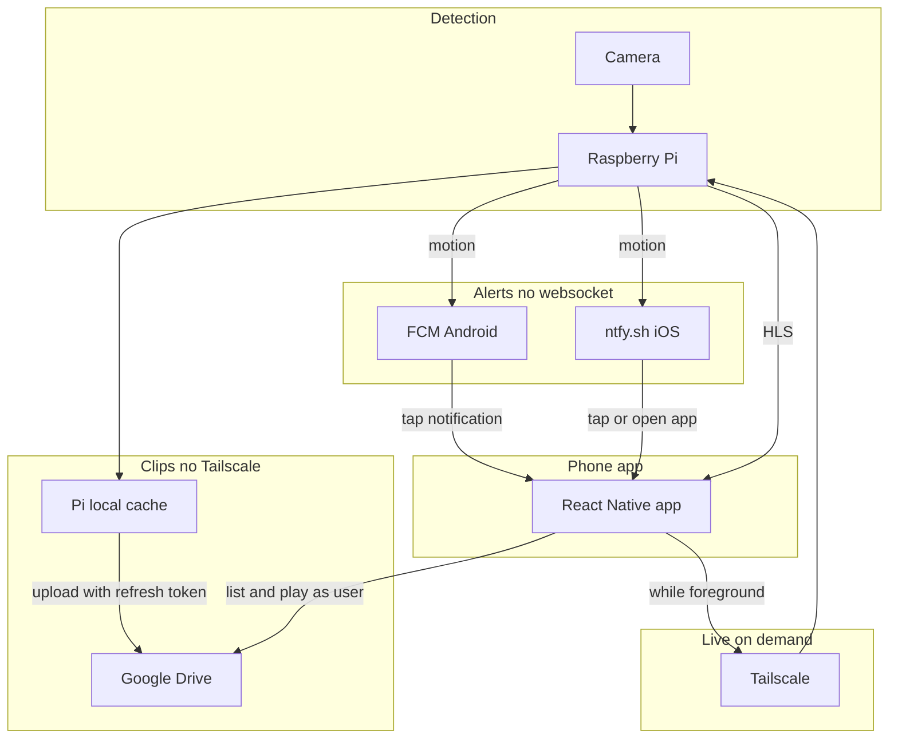
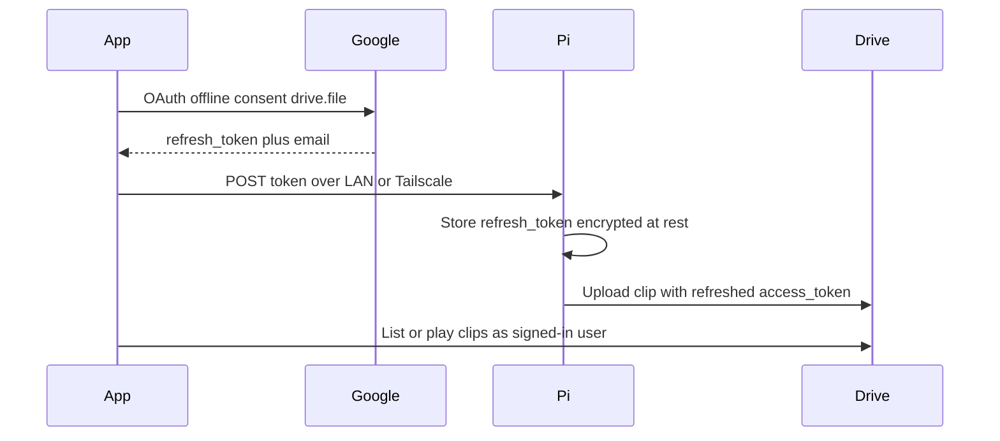

# Local-First Architecture Storyboard

> **Status:** `Draft` · **Stack:** React Native (`mobile/`) · **Docs only** (no feature code in this revision)  
> **Last updated:** 2026-08-02  
> Edit this file on GitHub: open → pencil → change one Act or one Decision Log row → commit.

---

## Quick nav

| Jump | Section |
|------|---------|
| [Decisions](#decision-log) | Locked product choices |
| [Big picture](#architecture) | System diagram |
| [Act 1](#act-1--setup-baseline) | SoftAP, Pi IP, Tailscale, pairing |
| [Act 2](#act-2--intruder-alert--android-fcm) | Android FCM alerts |
| [Act 3](#act-3--intruder-alert--ios-ntfysh) | iOS ntfy.sh alerts |
| [Act 4](#act-4--on-demand-livestream-tailscale) | Live only while app is open |
| [Act 5](#act-5--clips-pi-cache--drive--app) | Cache → Drive → app |
| [Act 6](#act-6--tbd-esp-discovers-pi) | ESP ↔ Pi discovery (unfinished) |
| [Out of scope](#out-of-scope) | Explicit non-goals |
| [Later](#implementation-notes-later) | Pointers for future PRs |

---

## Decision log

> Add a new row when a choice changes. Keep **Choice** short so the table stays scannable in the GitHub editor.

| ID | Decision | Choice | Date | Notes |
|----|----------|--------|------|-------|
| D1 | Mobile client | React Native Expo app in `mobile/` | 2026-08-02 | Dev/prod build for push; not Expo Go |
| D2 | Android alerts | `expo-notifications` + **FCM** | 2026-08-02 | Pi sends FCM on motion |
| D3 | iOS alerts | Public **ntfy.sh** | 2026-08-02 | Secret topic; no Tailscale required for the buzz |
| D4 | Livestream path | **Tailscale** to Pi | 2026-08-02 | On-demand when app is open only |
| D5 | Alert transport | **No** persistent WebSocket | 2026-08-02 | FCM / ntfy wake the user |
| D6 | Clip storage | Pi **cache** → **Google Drive** | 2026-08-02 | App reads Drive; no Tailscale for clips |
| D7 | Drive auth | Phone Google OAuth → **refresh token** to Pi | 2026-08-02 | Not password; `drive.file` scope |
| D8 | Remote product tunnel | Tailscale (not ngrok/Cloudflare as product) | 2026-08-02 | ngrok OK for ad-hoc dev only |
| D9 | ESP ↔ Pi discovery | **TBD** | 2026-08-02 | mDNS or static IP — see Act 6 |
| D10 | Cloud S3 / cloud-backend clips | Retire as product path | 2026-08-02 | Local-first + Drive instead |

---

## Architecture



### Google token handoff



<details>
<summary><strong>Security notes (token handoff)</strong></summary>

- Hand off only over **home LAN** or **Tailscale** — never over a raw public URL without auth.
- Store on Pi **encrypted at rest**; never write tokens to app logs or `pi-setup.log`.
- Scope: `https://www.googleapis.com/auth/drive.file` only (create/manage files the app opens).
- Provide a **revoke / re-auth** path in Settings if Drive uploads start failing.
- Future code may adapt helpers from `cloud-backend/googleAuth.js` and `cloud-backend/driveUploader.js` onto the Pi.

</details>

---

## Act 1 — Setup baseline

| | |
|--|--|
| **Goal** | Pi on home Wi‑Fi with known address; phone can reach Pi on LAN; Tailscale ready for away-live; app holds Pi host |
| **Actors** | Phone app · Pi SoftAP · Home Wi‑Fi · Tailscale · User |

### Flow

1. Unconfigured Pi boots SoftAP (`HomeSecurity-Setup` / setup path in `PI-SOFTAP-README.md`).
2. User joins SoftAP; app wizard sends home Wi‑Fi credentials (`mobile` Setup · Act already started).
3. Pi joins home LAN at static IP **`192.168.0.236`** (already enforced on device).
4. App verifies Pi (`GET /health`), **saves Pi host**.
5. User installs **Tailscale** on Pi and phone (same tailnet); note MagicDNS / `100.x` host for Act 4.
6. *(Future)* App pairs a long-lived **device token** with the Pi for API auth.

### Build checklist

- [ ] SoftAP → home Wi‑Fi → verify LAN health (existing wizard)
- [ ] Persist Pi host in app storage / Settings
- [ ] Document Tailscale install steps for Pi + phone
- [ ] Define app↔Pi paired token API (future PR)

### Test protocol — Act 1

| # | Step | Expected | Pass |
|---|------|----------|------|
| 1.1 | Preconditions: Pi in SoftAP or “Skip — already on LAN” | Setup screen usable | [ ] |
| 1.2 | Complete SoftAP creds or skip; phone on home Wi‑Fi | `GET http://192.168.0.236:4000/health` succeeds | [ ] |
| 1.3 | Kill and reopen app | Saved Pi host still present in Settings / Live meta | [ ] |
| 1.4 | Tailscale connected on Pi and phone | `tailscale status` shows both; ping Pi MagicDNS or `100.x` works | [ ] |
| 1.5 | **Fail:** phone on cellular, Tailscale **off**, hit LAN IP | Health fails; UI shows clear “unreachable” (not hang) | [ ] |

**Failure modes:** SoftAP scan fails → not on `HomeSecurity-Setup`. Health 404/timeout → backend not listening on `:4000`. Wrong subnet → static IP mismatch.

---

## Act 2 — Intruder alert — Android (FCM)

| | |
|--|--|
| **Goal** | Locked / killed Android app still gets a motion notification; tap opens the app |
| **Actors** | Pi · Firebase FCM · Expo notifications · Android phone |

### Flow

1. Dev/prod build registers for push (`expo-notifications` + FCM).
2. App sends **FCM device token** to Pi (LAN or Tailscale) once paired.
3. On motion, Pi POSTs to FCM with title/body (and optional deep link data).
4. OS shows lock-screen notification.
5. User taps → app opens (Live or Alerts screen). **No** background WebSocket.

### Build checklist

- [ ] Firebase project + `google-services.json` for the app
- [ ] `expo-notifications` in a **development/production** build (not Expo Go)
- [ ] Pi endpoint: register token; Pi sender using FCM HTTP v1
- [ ] Notification tap → navigate to Live / event

### Test protocol — Act 2

| # | Step | Expected | Pass |
|---|------|----------|------|
| 2.1 | Preconditions: paired token on Pi; notifications allowed | Token stored on Pi | [ ] |
| 2.2 | Force-stop app; lock screen | App not in recents / not foreground | [ ] |
| 2.3 | Trigger motion on Pi (or `POST` test alert) | Notification within **≤ 15 s** | [ ] |
| 2.4 | Tap notification | App opens to agreed screen | [ ] |
| 2.5 | **Fail:** revoke FCM token / wrong project | Pi logs send error; no silent success | [ ] |
| 2.6 | **Fail:** notifications disabled in OS | First launch prompts or Settings CTA | [ ] |

**Failure modes:** Expo Go used → push unreliable/wrong app id. Token never uploaded → Pi has nothing to target. Clock/network on Pi blocked to Google → send fails.

---

## Act 3 — Intruder alert — iOS (ntfy.sh)

| | |
|--|--|
| **Goal** | iPhone gets motion buzz via public ntfy without Tailscale for the alert itself |
| **Actors** | Pi · ntfy.sh · iOS ntfy app (or in-app subscribe later) · User |

### Flow

1. Generate a **high-entropy secret topic** (treat like a password); store on Pi and show once in app Settings.
2. User subscribes to `https://ntfy.sh/<topic>` (ntfy iOS app for v1).
3. On motion, Pi `POST`s to `https://ntfy.sh/<topic>` with message body.
4. User sees notification; opens Home Security app when ready.
5. Livestream still uses Act 4 (Tailscale) after open — ntfy does not carry video.

### Build checklist

- [ ] Pi config: `NTFY_TOPIC` (secret)
- [ ] Pi motion hook: HTTP POST to ntfy.sh
- [ ] App Settings: show topic + deep link / copy for ntfy app
- [ ] Optional later: in-app ntfy subscribe without separate app

### Test protocol — Act 3

| # | Step | Expected | Pass |
|---|------|----------|------|
| 3.1 | Preconditions: topic set; ntfy app subscribed; Pi online | Subscription active | [ ] |
| 3.2 | Lock iPhone; Home Security app not required to be open | — | [ ] |
| 3.3 | Trigger motion / test POST from Pi | ntfy notification within **≤ 15 s** | [ ] |
| 3.4 | Open Home Security app after tap or manually | App can proceed to Live (Act 4) if Tailscale up | [ ] |
| 3.5 | **Fail:** wrong topic | No notification on phone; Pi POST still 200 to unused topic — verify topic match in Settings | [ ] |
| 3.6 | **Fail:** guessable topic | Document rejection; rotate topic in test | [ ] |

**Failure modes:** Topic leaked → strangers can spam or snoop titles. ntfy.sh outage → no iOS buzz (LAN Live still works). User never subscribed → silent miss.

<details>
<summary><strong>Example Pi test POST</strong></summary>

```bash
curl -d "Intruder detected" \
  -H "Title: Home Security" \
  -H "Priority: high" \
  https://ntfy.sh/YOUR_SECRET_TOPIC
```

</details>

---

## Act 4 — On-demand livestream (Tailscale)

| | |
|--|--|
| **Goal** | User watches live **only while the app is open**, reaching the Pi through Tailscale when away |
| **Actors** | App · Tailscale · Pi HLS/backend |

### Flow

1. User opens app (often from FCM/ntfy tap).
2. App resolves Pi base URL: prefer **Tailscale host** when off LAN; else saved LAN IP.
3. Optional: `POST /start` (or equivalent) then play **HLS** from Pi.
4. User leaves app → stop requesting segments; **no** persistent alert socket.
5. If Tailscale disconnected → clear error: enable Tailscale or join home Wi‑Fi.

### Build checklist

- [ ] Configurable Pi base URL: LAN + Tailscale hostname
- [ ] Live player against Pi HLS
- [ ] Start/stop stream when entering/leaving Live screen
- [ ] Reachability check before play

### Test protocol — Act 4

| # | Step | Expected | Pass |
|---|------|----------|------|
| 4.1 | Preconditions: Pi streaming stack up; Tailscale on phone + Pi | Both online in `tailscale status` | [ ] |
| 4.2 | Phone on cellular; open Live | HLS plays via Tailscale host within **≤ 10 s** to first frame (or documented budget) | [ ] |
| 4.3 | Leave Live / background app | Pi stop called or segment fetches cease (no forever download) | [ ] |
| 4.4 | Disable Tailscale on phone; stay on cellular; open Live | Clear unreachable error; no infinite spinner | [ ] |
| 4.5 | Re-enable Tailscale; retry | Stream recovers | [ ] |
| 4.6 | On home Wi‑Fi without Tailscale | LAN IP path still plays | [ ] |

**Failure modes:** Playing LAN IP while away → timeout. Firewall/CGNAT rare with Tailscale but DERP relay may add latency. Heavy cellular data — warn in UI if needed.

---

## Act 5 — Clips: Pi cache → Drive → app

| | |
|--|--|
| **Goal** | Event clips land on Pi disk first, upload to the **user’s** Google Drive; app browses Drive **without** Tailscale |
| **Actors** | App · Google OAuth · Pi · Drive API |

### Flow

1. User signs into Google **in the phone app** (`access_type=offline`, `drive.file`).
2. App sends **refresh token + email** to Pi over LAN or Tailscale (Act 1 path).
3. On event: Pi writes clip to **local cache**, then uploads to Drive with refreshed access token.
4. App lists/plays clips via **Drive** (user session), not via Tailscale video tunnel.
5. Pi may delete or prune local cache after successful upload (policy TBD in implementation).

### Build checklist

- [ ] App Google OAuth (Expo Auth Session / similar)
- [ ] `POST` handoff endpoint on Pi; encrypted token store
- [ ] Pi: cache file → Drive upload job + retry
- [ ] App Clips tab: Drive-backed list/playback
- [ ] Re-auth UX when refresh token revoked

### Test protocol — Act 5

| # | Step | Expected | Pass |
|---|------|----------|------|
| 5.1 | Preconditions: OAuth done; handoff succeeded; Pi has token | Pi status shows Drive linked | [ ] |
| 5.2 | Trigger event that produces a clip | File appears under Pi cache path within budget | [ ] |
| 5.3 | Wait for upload | File appears in user’s Drive (agreed folder) | [ ] |
| 5.4 | Phone on cellular; **Tailscale off**; open Clips in app | Clip listed and playable from Drive | [ ] |
| 5.5 | **Fail:** revoke Google access in account settings | Next upload fails loudly; app prompts re-auth | [ ] |
| 5.6 | **Fail:** handoff over public unauthenticated URL | Must be rejected or unreachable in design — verify only LAN/TS | [ ] |

**Failure modes:** Missing `prompt=consent` → no refresh token. Upload quota / Drive API errors. App using wrong Google account vs token on Pi.

---

## Act 6 — TBD: ESP discovers Pi

| | |
|--|--|
| **Goal** | ESP32 finds the Pi on the home network after provisioning (**not designed yet**) |
| **Actors** | ESP32 · Pi · Home LAN |
| **Status** | `TBD` — do not implement in the push/Drive/Tailscale PRs |

### Candidates (pick later)

| Option | Idea | Pros | Cons |
|--------|------|------|------|
| Static IP | Pi stays `192.168.0.236`; ESP configured with that IP (wizard / `setmasterip`) | Simple; already assumed in SoftAP docs | Breaks if subnet changes |
| mDNS | Pi advertises e.g. `homesecurity-pi.local` | No hard-coded IP | mDNS flaky on some APs / ESP stacks |
| Hybrid | Static default + mDNS fallback | Resilient | More firmware/app work |

### Build checklist (placeholder)

- [ ] Decide static vs mDNS vs hybrid
- [ ] ESP firmware API to set/resolve Pi base URL
- [ ] Wizard step: pass Pi host from phone → ESP (after Act 1)
- [ ] Test protocol once decision lands

### Test protocol — Act 6

> Fill in after D9 is resolved. Until then: **skip**.

| # | Step | Expected | Pass |
|---|------|----------|------|
| 6.x | _TBD_ | _TBD_ | [ ] |

---

## Out of scope

| Item | Why |
|------|-----|
| Persistent WebSocket / SSE for alerts | Replaced by FCM + ntfy |
| S3 / cloud-backend as clip or live CDN | Local-first + Drive |
| Cloudflare Tunnel / ngrok as **product** remote access | Tailscale chosen; ngrok OK for brief dev |
| Replacing SoftAP Pi Wi‑Fi wizard | Keep; extend later |
| Implementing ESP discovery in this doc’s “done” criteria | Act 6 is explicitly TBD |
| Relying on Expo Go for FCM | Use dev/prod builds |

---

## Implementation notes (later)

| Area | Starting points in repo |
|------|-------------------------|
| SoftAP / Pi IP | `mobile/app/(tabs)/setup.tsx`, `PI-SOFTAP-README.md`, `pi-setup-api.py` |
| Pi host persistence | `mobile/context/SetupWizardContext.tsx`, `mobile/lib/storage.ts` |
| Drive OAuth patterns | `cloud-backend/googleAuth.js`, `cloud-backend/driveUploader.js` (port to Pi later) |
| Legacy cloud alerts | `cloud-backend` SSE / `MotionAlert` — retire for product path |
| Android pairing reference | `ESP32PairingApp` local notifications (not FCM) |

---

## How to edit this storyboard on GitHub

1. Open this file in the repo on github.com.
2. Click the pencil (**Edit**).
3. Prefer editing:
   - one **Decision log** row, or
   - one **Act** block (flow / checklist / test table).
4. Keep Act headings as `## Act N — …` so Quick nav anchors stay stable.
5. Mermaid: keep node IDs without spaces; quote labels that contain punctuation.
6. Check boxes in test tables with `[x]` when a protocol pass is recorded in a PR description or commit.

---

## Revision history

| Date | Change |
|------|--------|
| 2026-08-02 | Initial draft: FCM Android, ntfy.sh iOS, Tailscale live-on-demand, Drive clips + OAuth handoff, ESP TBD |
